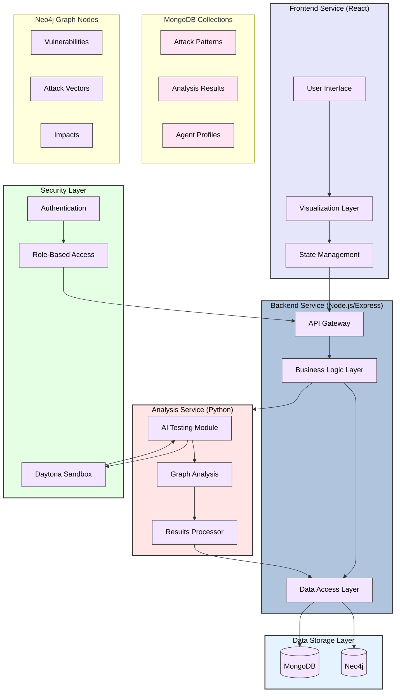

```mermaid
graph TB
    %% Main Services
    subgraph Frontend["Frontend Service (React)"]
        UI[User Interface]
        Viz[Visualization Layer]
        State[State Management]
    end

    subgraph Backend["Backend Service (Node.js/Express)"]
        API[API Gateway]
        BLL[Business Logic Layer]
        DAL[Data Access Layer]
    end

    subgraph Analysis["Analysis Service (Python)"]
        AITest[AI Testing Module]
        GraphAnalysis[Graph Analysis]
        Results[Results Processor]
    end

    subgraph Storage["Data Storage Layer"]
        MongoDB[(MongoDB)]
        Neo4j[(Neo4j)]
    end

    subgraph Security["Security Layer"]
        Daytona[Daytona Sandbox]
        Auth[Authentication]
        RBAC[Role-Based Access]
    end

    %% Frontend Connections
    UI --> Viz
    Viz --> State
    State --> API

    %% Backend Connections
    API --> BLL
    BLL --> DAL
    DAL --> MongoDB
    DAL --> Neo4j
    BLL --> Analysis

    %% Analysis Service Connections
    AITest --> GraphAnalysis
    GraphAnalysis --> Results
    Results --> DAL
    AITest --> Daytona

    %% Security Connections
    Auth --> RBAC
    RBAC --> API
    Daytona --> AITest

    %% Database Collections
    subgraph MongoDB_Collections["MongoDB Collections"]
        AP[Attack Patterns]
        AR[Analysis Results]
        AG[Agent Profiles]
    end

    %% Neo4j Nodes
    subgraph Neo4j_Nodes["Neo4j Graph Nodes"]
        V[Vulnerabilities]
        AV[Attack Vectors]
        I[Impacts]
    end

    %% Style Definitions
    classDef frontend fill:#E6E6FA,stroke:#333,stroke-width:2px,color:#000
    classDef backend fill:#B0C4DE,stroke:#333,stroke-width:2px,color:#000
    classDef analysis fill:#FFE5E5,stroke:#333,stroke-width:2px,color:#000
    classDef database fill:#E5F3FF,stroke:#333,stroke-width:2px,color:#000
    classDef security fill:#E5FFE5,stroke:#333,stroke-width:2px,color:#000
    classDef collection fill:#FFE5F3,stroke:#333,stroke-width:1px,color:#000
    classDef node fill:#F3E5FF,stroke:#333,stroke-width:1px,color:#000

    %% Apply Styles
    class Frontend frontend
    class Backend backend
    class Analysis analysis
    class Storage database
    class Security security
    class AP,AR,AG collection
    class V,AV,I node
``` 
